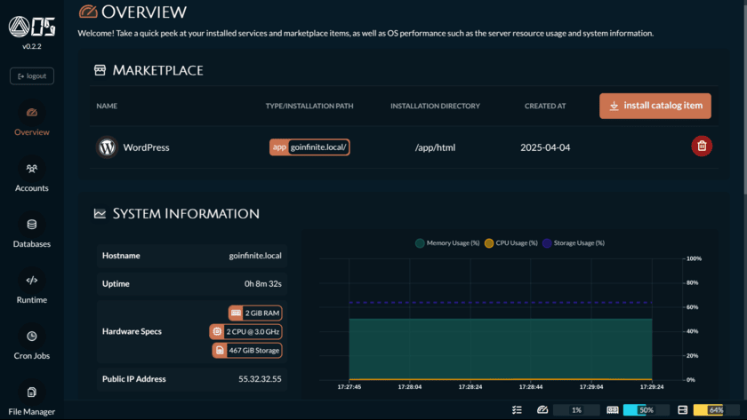

# [Infinite OS](https://goinfinite.net/os/) &middot; [](https://github.com/orgs/goinfinite/projects/9) [](https://os.demo.goinfinite.net:1618/) [](https://www.reddit.com/r/goinfinite/) [](https://github.com/orgs/goinfinite/discussions) [](https://goreportcard.com/report/github.com/goinfinite/os) [](https://github.com/goinfinite/os/blob/main/LICENSE.md)

Infinite OS is the simplest way to deploy containerized applications. Full stop. Even if containers sound like rocket science to you, you'll be launching apps with just a few clicks. 🚀



### What's This All About Then?

We've created something rather special - a "metamorphic" container image. Yes, we made up that term because **nothing else quite does what Infinite OS does**!

The traditional container dance goes: write Dockerfile, build image, run container, repeat until your coffee goes cold. Tedious, isn't it?

With Infinite OS, **you can skip all that faff**. No Dockerfile wizardry required. Simply run our container image and then deploy your applications with minimal fuss with the web dashboard, CLI or REST API. Like a magic box. 🧞

For the tech wizards among you - yes, you can still build your own custom Dockerfile images on top of Infinite OS with your preferred applications pre-installed. We're flexible like that.

### Plays Well With Others

Infinite OS works flawlessly with any container orchestration tool that speaks OCI: Docker, Podman, Docker Swarm, Rancher, Kubernetes - the lot.

Though if you fancy an even smoother experience, do check out our sibling project [Infinite Ez](https://github.com/goinfinite/ez) - a self-hosted PaaS solution that pairs perfectly with Infinite OS. Also free and refreshingly straightforward.

### What Infinite OS Is

- Your get-out-of-jail-free card for never writing another Dockerfile;
- A shape-shifting container that becomes what you need AFTER you run it;
- A lightweight web dashboard, CLI and REST API that sips resources (mere ~80MB RAM);
- A handy marketplace to quickly launch and manage apps, databases, etc.

### What Infinite OS Isn't

- A container engine itself (like Docker or Podman);
- A self-hosted PaaS solution (that's [Infinite Ez's](https://github.com/goinfinite/ez) job);
- A replacement for Docker, Podman, Kubernetes or any container orchestration tool.

## Online Demo

A read-only demo of the dashboard is available at [https://os.demo.goinfinite.net:1618/](https://os.demo.goinfinite.net:1618/). The default credentials are `demo` (user) and `abc123` (password). You can use this demo to explore the dashboard and see how it works. Please note that this is a read-only demo, so you won't be able to make any changes or deploy any applications.

## Features

- **Web Dashboard**: A slick web interface where you can manage your environment and deploy apps without breaking a sweat;
- **CLI and REST API**: Everything you can do with clicks, you can do with commands or calls - choose your weapon!
- **Services Catalog**: Runtimes, programming languages, databases - all deployed with fewer clicks than ordering a takeaway;
- **Marketplace Catalog**: Applications, frameworks and entire tech stacks just waiting for you to press the big friendly button;
- **Cron Jobs**: Schedule tasks to run whenever you fancy - while you're sleeping, on tea breaks, or precisely at 3:42 PM on Thursdays;
- **File Manager**: Built-in interface to poke around your container's files and folders without needing to be a terminal ninja;
- **Automatic SSL**: Let's Encrypt certificates that sort themselves out - because life's too short to manually configure SSL;
- **Automatic Mappings**: Your marketplace apps magically appear at exactly the right path and domain name - no configuration gymnastics required;
- **Mapping Security Rules**: Protect your applications with custom rate, bandwidth and connection limits;
- **NGINX baked-in**: NGINX comes pre-configured and ready to rock with both the dashboard and your applications;
- **Runtime Settings**: Tweak PHP versions, NGINX configurations and more - all the knobs and dials you need;
- **User Management**: Create accounts for the whole team (or just yourself with different hats on) and manage them all in one place.

## Get Started

```
This project is still under active development (beta stage).
Expect bugs early on. Create issues so they can be fixed.
```

### Deploying the Container

Infinite OS is designed to be flexible, so you can run it with your preferred graphical user interface (GUI) or command line interface (CLI). This includes popular tools like Docker Desktop, Podman Desktop, Rancher Desktop, Orbstack, Portainer, Kubernetes, and any other OCI-compliant container manager.

#### Command Line Interface (CLI) Example

```
docker run --rm --name 'myapp.net' \
  --env 'PRIMARY_VHOST=myapp.net' \
  -p 8080:80 -p 8443:443 -p 1618:1618 \
  -it docker.io/goinfinite/os:latest
```

#### Graphical User Interfaces (GUI) Example

If you prefer a GUI, the process is similar across most tools:

1. Define the container image URL as `docker.io/goinfinite/os:latest`;
2. Define the container name to your domain name, e.g. `myapp.net`;
3. Set the environment variable `PRIMARY_VHOST` also to your domain name, e.g. `myapp.net`;
4. The only necessary port to publish is 1618, which is the API and dashboard port. The other ports are optional and only needed if you want to access the applications directly from the host. Common used ports are 8080 for the container HTTP port (80) and 8443 for the container HTTPS port (443);
5. Start the container and you're good to go!

### Accessing the Dashboard

Once the container is up and running, you can access the dashboard with your web browser. The dashboard is available at [`https://localhost:1618/`](https://localhost:1618/) (or the IP address of your host machine if you're not using localhost).

The first time you log in, you'll be prompted to create an admin account via the setup wizard. This one-time process allows you to create an admin account for managing your applications.

The dashboard is where the magic happens. You can deploy applications with just a few clicks using the Marketplace feature. Plus, every action you take in the dashboard has a corresponding CLI and REST API command, making it easy to automate your deployments and manage your applications programmatically.

For example, to deploy a WordPress application, you can use the following CLI command inside the container:

```
os mktplace install -s wp \
  -f 'adminUsername:admin' \
  -f 'adminPassword:abc123' \
  -f 'adminMailAddress:user@example.com'
```

## Support

Need help or have questions? We got you covered!

Open an issue on our [GitHub repository](https://github.com/goinfinite/os), start a discussion on [GitHub discussions](https://github.com/orgs/goinfinite/discussions) or [Reddit](https://www.reddit.com/r/goinfinite/), or hear me out - consider our cloud offerings at [goinfinite.net](https://goinfinite.net)! ♥️

## Sponsorship

Your support means the world to us! If you find Infinite OS useful, please consider sponsoring us on [GitHub](https://github.com/sponsors/goinfinite) or choosing one of our [cloud offerings](https://goinfinite.net). Your contributions help us maintain and improve the project, ensuring its continued development and support.

## Contributing

Ready to contribute to Infinite OS? Please refer to our [CONTRIBUTING.md](docs/CONTRIBUTING.md) file for more information on how to get involved.

## Roadmap

The public roadmap is available at [GitHub Projects](https://github.com/orgs/goinfinite/projects/9). Before opening an issue, please discuss your feature requests with our community. We're open to suggestions and feedback, and we encourage you to share your ideas with us.

For bug fixes, please open an issue with as much detail as possible, including steps to reproduce the issue, expected behavior, and any relevant logs or screenshots. This helps us address the problem more efficiently.

## License

This project is licensed under the Eclipse Public License (EPL) version 2.0. See the [LICENSE.md](LICENSE.md) file for details.

## Acknowledgements

We're grateful to our contributors, supporters, and the open-source community for making Infinite OS possible. Special thanks to the maintainers of the various open-source libraries and tools that power our project. You can find a complete list of dependencies in our `go.mod` file and on the `Containerfile`.

## Disclaimer

Infinite OS is still in the beta stage of development. While we strive to provide a stable and reliable product, please be aware that there may be bugs and issues. We appreciate your understanding and encourage you to report any problems you encounter, helping us improve the project.
